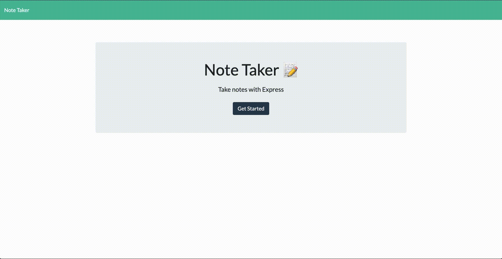

# Note-Taker
  ## Description
  Note Taker can be used to write and save notes. This application will use an Express.js back end and will save and retrieve note data from a JSON file.

  ## Table of Content
  * [Installation](#installation)
  * [Heroku](#heroku)
  * [Finished_Requirements](#finished_Requirements)
  * [Demo](#demo)

  ## Installation
  Git clone the repo, and run node server.js. Remember to install all required dependencies.
  
  ## Heroku 
  [Heroku](https://morning-gorge-44836.herokuapp.com/)

  ## Finished_Requirements
  * Presented with a landing page with a link to a notes page

  * Presented with a page with existing notes listed in the left-hand column, plus empty fields to enter a new note title and the note’s text in the right-hand column

  * Save note

  * New note

  * Click an existing note and note appears in the right-hand column

  * All requirements finished include deleting note

  ## Demo
  

  